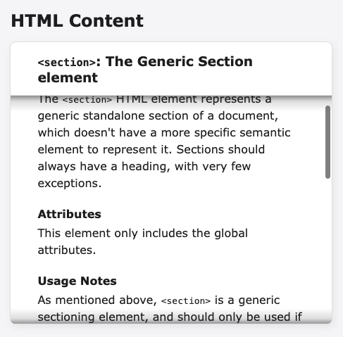

# `overflow-shadow`

Having long content overflowing a container on a web page can become a problem, especially when the user's environment does not show a scrollbar. `overflow-shadow` solves this by showing a shadow gradient along the edge of the container that is overflowing. The implementation is in pure JavaScript and is simple to use.

In the picture the linear gradient shadows can be seen on top and bottom of the content box:



## Usage

Add an attribute `overflow-shadow` to the appropriate containers on the page and make sure the script [`overflow-shadow.js`](overflow-shadow.js) is executed.

```html
<div overflow-shadow>
  /* Long content */
</div>
```

The script appends the CSS styles and the necessary DOM elements automatically. Currently, there are no settings or customizations available.

## Demo

Links to pages with examples.

* Demo page – https://tapiocode.github.io/overflow-shadow/
* CodePen – https://codepen.io/tapiocode/pen/NWLamZO

# License

MIT License
